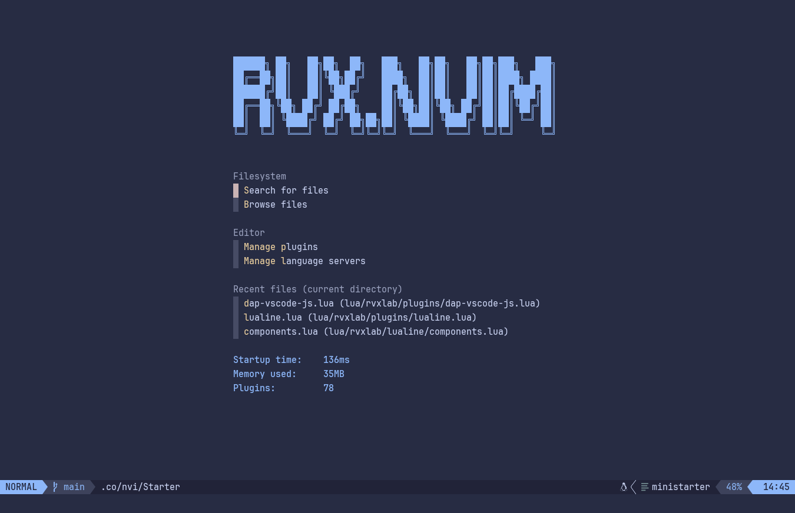
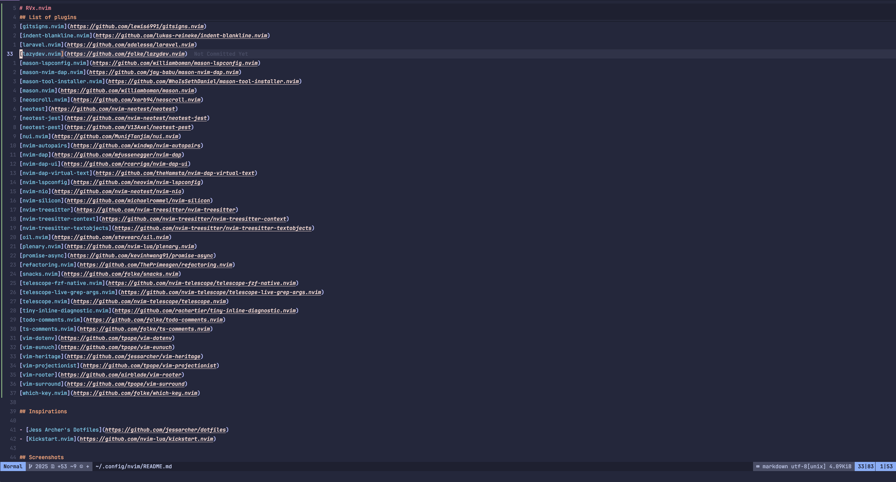
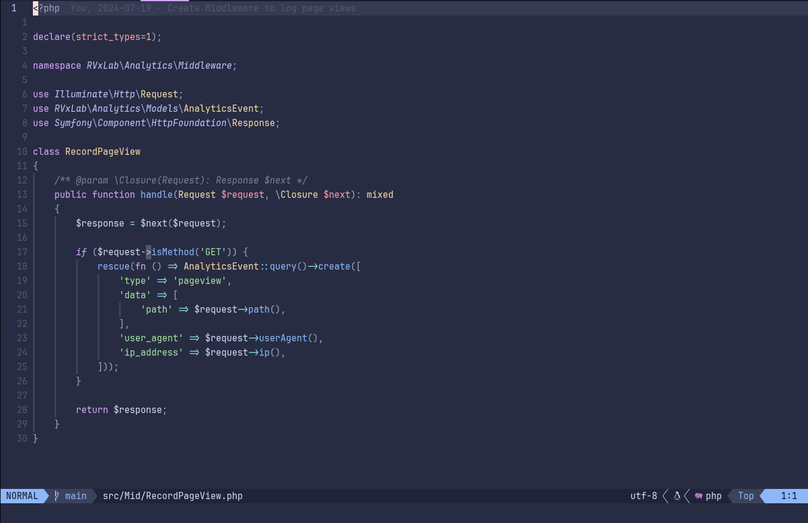

# RVx.nvim

My Neovim config from scratch based on [mini.nvim](https://github.com/echasnovski/mini.nvim).

## Features

- IDE for web and systems development
- 🚀 Blazingly fast startup time
- Lean memory usage (~125MB in a medium-sized Laravel project)
- Super simple package management using [mini.deps](https://github.com/echasnovski/mini.deps)
- Completion using [blink.cmp](https://github.com/hrsh7th/nvim-cmp)
- Lazygit integration using [Snacks.nvim](https://github.com/folke/snacks.nvim)
- Testing using [Neotest](https://github.com/nvim-neotest/neotest)
  - PHP (Pest)
  - JS/TS (Jest)
- Debugging using [Nvim DAP](https://github.com/mfussenegger/nvim-dap) + [UI](https://github.com/rcarriga/nvim-dap-ui)
  - PHP
  - JS/TS

## List of plugins

> ❗ This list has been generated using `:RvxDumpPlugins md`. See [commands.lua](./lua/commands.lua) for the implementation.

- [blink.cmp](https://github.com/saghen/blink.cmp)
- [catppuccin](https://github.com/catppuccin/nvim)
- [conform.nvim](https://github.com/stevearc/conform.nvim)
- [dressing.nvim](https://github.com/stevearc/dressing.nvim)
- [FixCursorHold.nvim](https://github.com/antoinemadec/FixCursorHold.nvim)
- [friendly-snippets](https://github.com/rafamadriz/friendly-snippets)
- [gitsigns.nvim](https://github.com/lewis6991/gitsigns.nvim)
- [laravel.nvim](https://github.com/adalessa/laravel.nvim)
- [lazydev.nvim](https://github.com/folke/lazydev.nvim)
- [mason-lspconfig.nvim](https://github.com/williamboman/mason-lspconfig.nvim)
- [mason-nvim-dap.nvim](https://github.com/jay-babu/mason-nvim-dap.nvim)
- [mason-tool-installer.nvim](https://github.com/WhoIsSethDaniel/mason-tool-installer.nvim)
- [mason.nvim](https://github.com/williamboman/mason.nvim)
- [mini.extra](https://github.com/echasnovski/mini.extra)
- [mini.icons](https://github.com/echasnovski/mini.icons)
- [mini.indentscope](https://github.com/echasnovski/mini.indentscope)
- [mini.pairs](https://github.com/echasnovski/mini.pairs)
- [mini.pick](https://github.com/echasnovski/mini.pick)
- [mini.splitjoin](https://github.com/echasnovski/mini.splitjoin)
- [mini.starter](https://github.com/echasnovski/mini.starter)
- [mini.statusline](https://github.com/echasnovski/mini.statusline)
- [mini.surround](https://github.com/echasnovski/mini.surround)
- [neoscroll.nvim](https://github.com/karb94/neoscroll.nvim)
- [neotest](https://github.com/nvim-neotest/neotest)
- [neotest-jest](https://github.com/nvim-neotest/neotest-jest)
- [neotest-pest](https://github.com/V13Axel/neotest-pest)
- [none-ls.nvim](https://github.com/nvimtools/none-ls.nvim)
- [nui.nvim](https://github.com/MunifTanjim/nui.nvim)
- [nvim-dap](https://github.com/mfussenegger/nvim-dap)
- [nvim-dap-ui](https://github.com/rcarriga/nvim-dap-ui)
- [nvim-dap-virtual-text](https://github.com/theHamsta/nvim-dap-virtual-text)
- [nvim-lspconfig](https://github.com/neovim/nvim-lspconfig)
- [nvim-nio](https://github.com/nvim-neotest/nvim-nio)
- [nvim-silicon](https://github.com/michaelrommel/nvim-silicon)
- [nvim-treesitter](https://github.com/nvim-treesitter/nvim-treesitter)
- [nvim-treesitter-context](https://github.com/nvim-treesitter/nvim-treesitter-context)
- [nvim-treesitter-textobjects](https://github.com/nvim-treesitter/nvim-treesitter-textobjects)
- [oil.nvim](https://github.com/stevearc/oil.nvim)
- [plenary.nvim](https://github.com/nvim-lua/plenary.nvim)
- [promise-async](https://github.com/kevinhwang91/promise-async)
- [refactoring.nvim](https://github.com/ThePrimeagen/refactoring.nvim)
- [snacks.nvim](https://github.com/folke/snacks.nvim)
- [telescope.nvim](https://github.com/nvim-telescope/telescope.nvim)
- [tiny-inline-diagnostic.nvim](https://github.com/rachartier/tiny-inline-diagnostic.nvim)
- [todo-comments.nvim](https://github.com/folke/todo-comments.nvim)
- [ts-comments.nvim](https://github.com/folke/ts-comments.nvim)
- [vim-dotenv](https://github.com/tpope/vim-dotenv)
- [vim-eunuch](https://github.com/tpope/vim-eunuch)
- [vim-heritage](https://github.com/jessarcher/vim-heritage)
- [vim-projectionist](https://github.com/tpope/vim-projectionist)
- [vim-rooter](https://github.com/airblade/vim-rooter)
- [which-key.nvim](https://github.com/folke/which-key.nvim)

## Inspirations

- [Jess Archer's Dotfiles](https://github.com/jessarcher/dotfiles)
- [Kickstart.nvim](https://github.com/nvim-lua/kickstart.nvim)

## Screenshots

